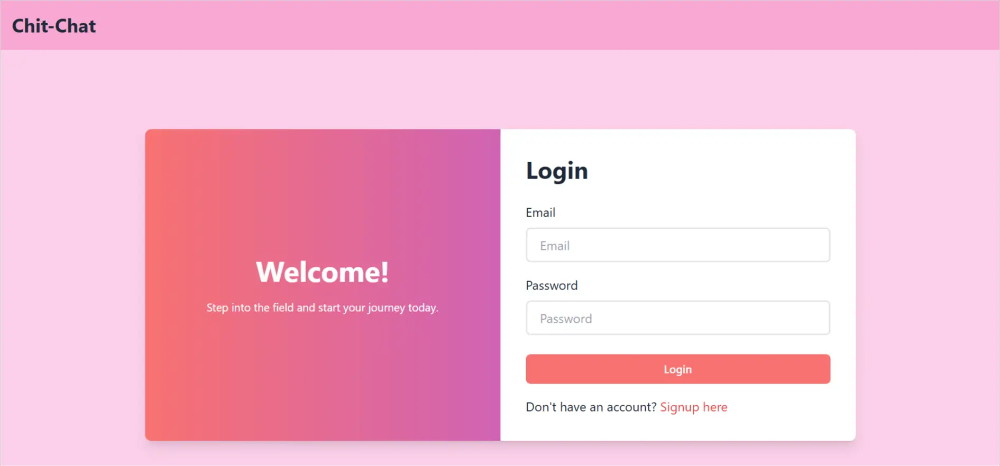
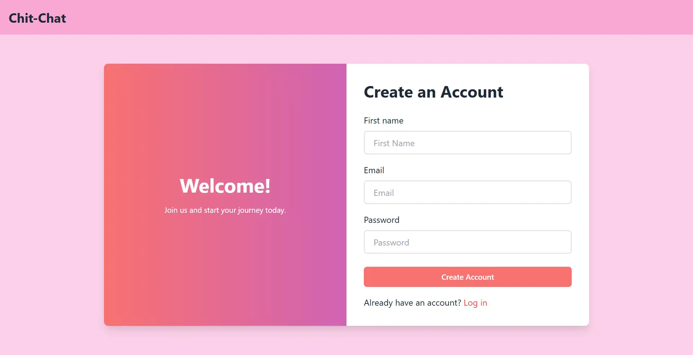
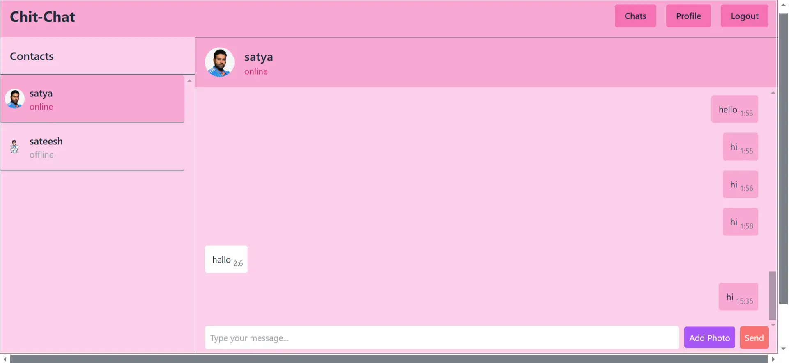
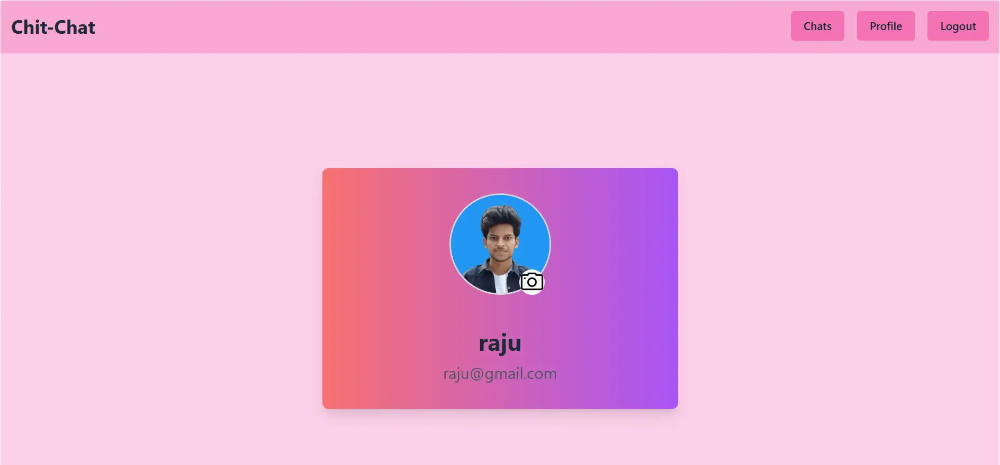

# Chit-Chat

## Description

Chit-Chat is a real-time messaging application built using the **MERN stack**. It allows users to communicate instantly, update their profiles, and manage their accounts seamlessly. Powered by **Socket.io**, it ensures a smooth and real-time chatting experience.

## Features

- 🔥 **Real-time Chat** using **Socket.io** for instant messaging
- 🔒 **Authentication** (Login & Signup) for secure access
- 🛠 **Profile Update** feature to manage user details

## Tech Stack

- **Frontend**: React.js, Zustand (for state management)
- **Backend**: Node.js, Express.js
- **Database**: MongoDB
- **Real-time Communication**: Socket.io

## Installation & Setup

Make sure you have **Node.js** and **MongoDB** installed on your system, then clone the repository and run:

**Create your own env file**
```sh
MONGODB_URL=
PORT=
JWT_SECRET=
NODE_ENV=
CLOUDINARY_CLOUD_NAME=
CLOUDINARY_API_KEY=
CLOUDINARY_API_SECRET=
```


**Run Locally**
```sh
>>git clone https://github.com/Raju-Munagala/chit-chat.git
>>cd chit-chat
>>npm run start
open another terminal
>>cd front-end
>>npm run dev
```


**For Deployment**
```sh
git clone https://github.com/Raju-Munagala/chit-chat.git
cd chit-chat
npm run build
npm run start
```


## Folder Structure

```sh
chit-chat/
 ├── front-end/       # React frontend
 ├── back-end/        # Express backend
 ├── screenshots/     # UI Screenshots
 ├── package.json     # Project configuration
 ├── README.md        # Documentation
```
## Screenshots

### 🔑 Authentication (Login & Signup)
**Login Page:**


**Signup Page:**


### 💬 Chat Interface


### 🛠 Profile Update


## License

This project is licensed under the **MIT License** – you are free to use, modify, and distribute it with proper attribution. See the [LICENSE](LICENSE.md) file for more details.


## Contact

📧 **Developer**: Raju Munagala  
🔗 **GitHub**: [@Raju-Munagala](https://github.com/Raju-Munagala)  
🚀 Happy Coding! 🎉
